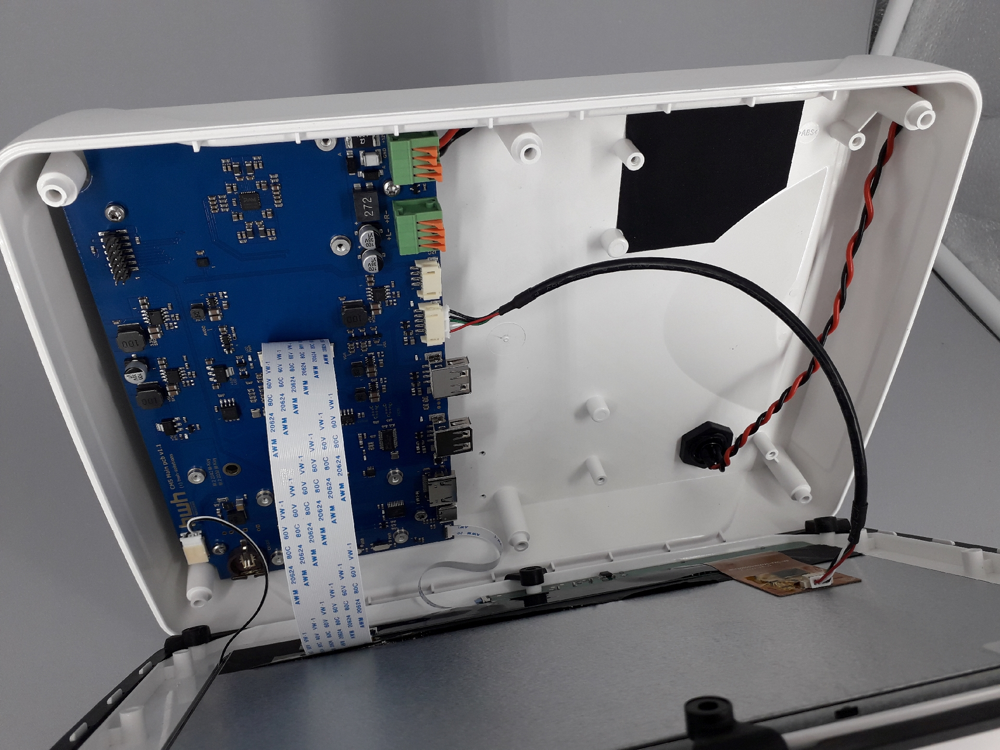

Geräteaufbau
============

Mechanischer Aufbau
-------------------

Mainboard
----------

Das Mainboard enthält alle elektrischen und elektronischen Komponenten wie:

.. image:: ../pics/PCB_Top_Side_Named.png
   :scale: 45%
Abb.: Mainboard Oberseite

.. image:: ../pics/PCB_Bottom_Side_Named.png
   :scale: 45%
Abb.: Mainboard Unterseite

Platinen
--------

Die Platinen für das Mainboard und die Hintergrundbeleuchtung wurden als zweiseitig bestückte SMD-Platine mit Durchkontaktierungen, Stopplack und Bedruckung ausgeführt.

.. image:: ../pics/PCB_Empty_Top_Side.png
   :scale: 45%
Abb.: Unbestückte Platinen-Oberseite

.. image:: ../pics/PCB_Empty_Bottom_Side.png
   :scale: 45%
Abb.: Unbestückte Platinen-Unterseite

Schaltplan und Fertigungsdaten
------------------------------

Der Schaltplan und die Platine wurden mit dem Entwicklungstool XXX erstellt. Nachfolgend sind die Unterlagen für eine Fertigung aufgeführt.

* `Schaltplan V2.1 [PDF] <../_static/files/xxx.pdf>`_
* `Gerber Daten [ZIP] <../_static/files/xxx.zip>`_
* `Bauteilliste [TXT] <../_static/files/xxx.txt>`_
* `Bestückung [HTML] <../_static/files/xxx.html>`_

.. image:: ../pics/Lizenz_by-nc-sa_eu.png
   :scale: 45%

Die Fertigungsdaten von Schaltplan, Gerber-Daten und Bauteilliste unterliegen der `Common Creative Lizenz (CC) BY BC SA 4.0`_. Das OBP60 darf nachgebaut oder modifiziert werden unter Nennung der Urheber. Es entstehen keinerlei Kosten für eine private Nutzung ohne kommerzielle Absichten. Eine kommerzielle Verwertung wird durch die Lizenz ausgeschlossen. Abgeleitete Werke unterliegen der selben Lizenz. Wenn Sie eine kommerzielle Nutzung des OBP60 beabsichtigen, kontaktieren Sie uns über das `Kontaktformular`_. Es besteht die Möglichkeit, ein nicht exklusives Nutzungsrecht über eine kommerzielle Lizenz zu erwerben.

.. _Common Creative Lizenz (CC) BY BC SA 4.0: https://creativecommons.org/licenses/by-nc-sa/4.0/legalcode.de
.. _Kontaktformular: https://open-boat-projects.org/de/kontakt

Schaltungsbeschreibung
----------------------
