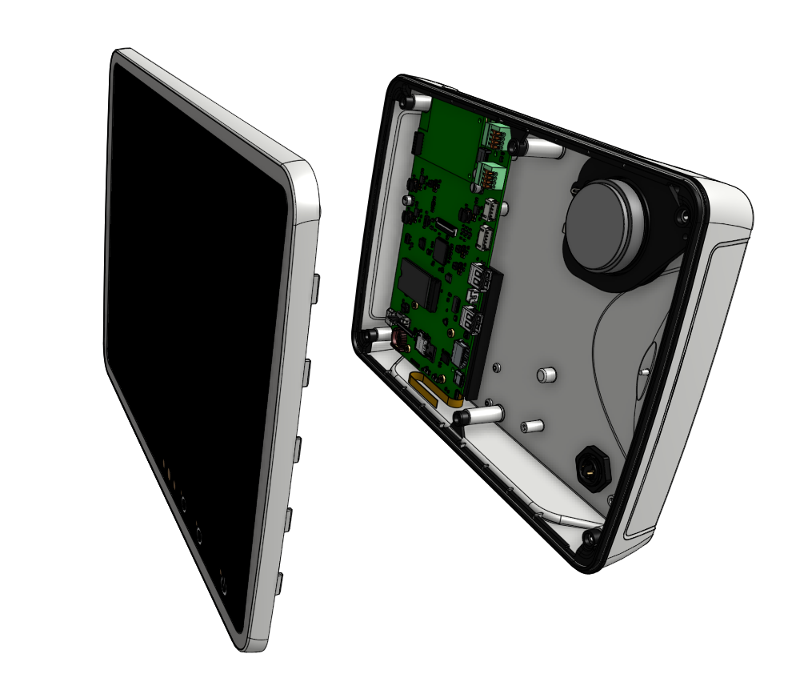
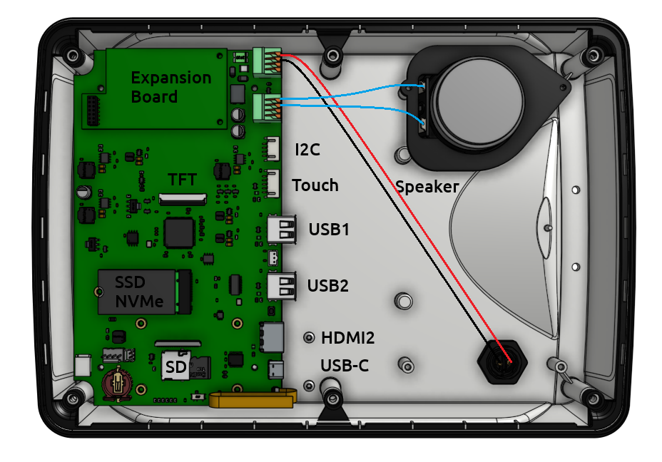
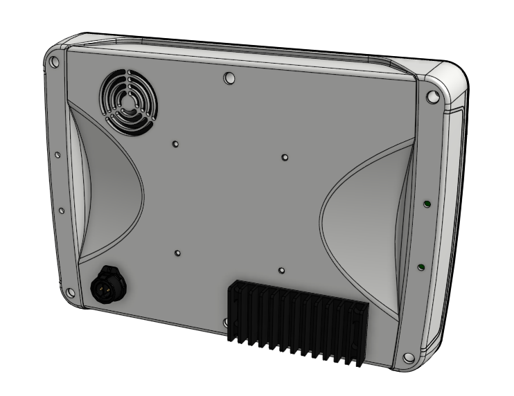

Technische Daten
================

.. image:: /pics/OBP_Plotter_Front_View_t.png
	:scale: 50%
	
Abb.: OBP-Plotter Basisgerät

Funktionen
----------

* Quad Core Prozessor
* Android Betriebssystem
* Vorinstallierte Navigations-Apps
* Vorinstallierte Karten
* Vorinstallierte Apps für Navigation und Unterhaltung
* 10-Zoll Touch-Display (tageslichttauglich)
* Umgebungslichtangepasste Displayhelligkeit
* 3 Sensor-Tasten (u.a. geeignet für Android Buttons)
* Signalgeber
	* Akustisch: Lautsprecher
	* Optisch: LEDs
* Erweiterungs-Port für:
	* NMEA0183, NMEA2000 und GPS (optional)
* NMEA0183 Multiplexer (in AVnav integriert)
* 2x USB-A (für Usererweiterungen)
* USB-C (OTG, Debug)
* WiFi
* Bluetooth
* Integrierte Sensoren für Bewegung und Umgebung
* Energiesparmodus
* Offene Architektur (Open Hardware, Open Source)

Aufbau
------

Abb.: OBP-Plotter Basisgerät Innenansicht

Abb.: OBP-Plotter Basisgerät Hauptplatine, CM5-Modul Unterseite

Spezifikation
-------------

+----------------------+-----------------------------+
| Versorgungsspannung  | 10...28 V, verpolungssicher |
+----------------------+-----------------------------+
| Stromverbrauch       | 7...18 W, typisch 12 W      |
+----------------------+-----------------------------+
| Prozessor            | BCM2712, Quad Core, 64 Bit  |
+----------------------+-----------------------------+
| Clock Speed          | 2.5 GHz, Auto-Speedstepping |
+----------------------+-----------------------------+
| RAM                  | 4 GB, fix                   |
+----------------------+-----------------------------+
| Flash                | 512 GB, SSD NVMe, wechselbar|
+----------------------+-----------------------------+
| Freier User-Bereich  | 500 GB, erweiterbar bis 2 TB|
+----------------------+-----------------------------+
| Flash-Format         | m.2, 2230, 2242             |
+----------------------+-----------------------------+
| Displaygröße         | 1250 x 800 pix, 60 Hz       |
+----------------------+-----------------------------+
| Displayhelligkeit    | 1000 nits, autom. geregelt  |
+----------------------+-----------------------------+
| Bedienung            | 5-Finger-Touch, regensicher |
+----------------------+-----------------------------+
| Sensortasten         | 3x kapazitiv                |
+----------------------+-----------------------------+
| Fernbedienung        | IR, 8 m                     |
+----------------------+-----------------------------+
| Kommunikation        | WiFi, 802.11 bgnac, 50 m    |
+----------------------+-----------------------------+
| WiFi Frequenzen      | 2.4 GHz, 5.0 GHz            |
+----------------------+-----------------------------+
| Ethernet-Protokolle  | HTTP, SSH, VNC, SMB, UDP    |
+----------------------+-----------------------------+
| Bluetooth            | BT 5.0, BLE                 |
+----------------------+-----------------------------+
| Bluetooth-Profile    | Heatset, A2DP, Fitness      |
+----------------------+-----------------------------+
| Erweiterungsport     | USB 3.0, I2C, SPI           |
+----------------------+-----------------------------+
| Schnittstellen       | 1x USB 3.0, 2x USB 2.0, Pwr |
+----------------------+-----------------------------+
| Signaleinrichtungen  | 2x LED, frontseitig         |
+----------------------+-----------------------------+
| Lautsprecher         | Mono, 10 W                  |
+----------------------+-----------------------------+
| Betriebssystem       | Android 15, AOSP            |
+----------------------+-----------------------------+
| ESD-Schutz           | 8 kV                        |
+----------------------+-----------------------------+
| Schutzgrad           | IP65                        |
+----------------------+-----------------------------+
| Zulassung            | CE, in Vorbereitung         |
+----------------------+-----------------------------+
| Abmessungen          | 285 x 198 x 46 mm           |
+----------------------+-----------------------------+
| Gewicht              | 1280 g                      |
+----------------------+-----------------------------+

Anschlussbelegung
-----------------

   
Abb.: OBP-Plotter Basisgerät Rückseite
   
Schaltplan
----------

* `Schaltplan V2.1 [PDF] <../_static/files/OBP_Plotter_Dimensions.pdf>`_

Maßbilder
---------

* `Maßbild [PDF] <../_static/files/OBP_Plotter_Dimensions.pdf>`_

   
Nutzbare Telegramme
-------------------

**NMEA0183 via WiFi**
    * AIVDM, AIVDO, DBK, DBS, DBT, DPT, GGA, GLL, GSA, GSV, HDG, HDM, HDT, MTW, MWD, MWV, RMB, RMC, ROT, RSA, VHW, VTG, VWR, XDR, XTE, ZDA
	
Vorinstallierte Apps
--------------------

Der OBP-Plotter ist so vorkonfiguriert, dass die Navigationslösung AVnav, das AVnav O-Charts Plugin, der AIS Catcher sowie das NMEA Dashboard aufeinander abgestimmt sind und funktionieren. Die Online- und Offline-Karten sind in AVnav bereits integriert. Der VNC- und SSH-Server sind standardmäßig aktiviert. 

**System**
	* Aptoide (Alternativer App Store)
	* Device Info (System Infobar)
	* Dateien
	* File Manager + (Filemanager mit Remote-Datenaustausch)
	* Galerie
	* Google PlayStore
	* Kontakte
	* Kalender
	* VNC-Server (in Android integriert)
	* SSH-Server (in Android integriert)
	* Systemeinstellungen
	* Offline Manual

**Navigation**
	* AIS Catcher (AIS Empfänger via USB RTL-SDR Stick)
	* AVnav (Webbasierte Open Source Navigation)
	* AVnav O-Charts Plugin (für kommerzielle Seekarten)
	* Boating App (Navigation)
	* C-Maps (Navigation)
	* Grib (Wetterdaten)
	* Maps(Navigation)
	* NV-Carts (Navigation)
	* Navily (Navigation)
	* NMEA Dashboard (Instrumentenanzeige)
	* Osmand (Navigation)
	* Orca (Navigation)
	* OpenCPN (Open Source Navigation)
	* Windfinder (Wetterinfo)
	* Windy (Wetterinfo)
	* SDRangel (SDR-Empfänger)
	* TiniCAM (IP-Kamera Dashborad)

**Unterhaltung**
	* Chrome (Webbrowser)
	* Fusion Audio (Control-System für Raymarine Audio)
	* GMail
	* Firefox (Webbrowser)
	* Internetradio
	* Lautsärkeregler
	* Netflix
	* Prime Video
	* RTL-SDR Driver (für SDR-Empfang)
	* FM-Radio (RTL-SDR basiert)
	* Spotify
	* Syntesizer (Klangeinstellung)
	* VLC (Universeller Mediaplayer für Bilder, Audio und Video)
	* WhatsApp
	
Vorinstallierte Seekarten
-------------------------

**Online**
	* BSH (rudimentäre Karte mit Tiefenlinien)
	* Open Sea Map (weltweit, ohne Tiefenangaben)
	* Waddenzee (DE, Wattenmeer NL, mit Tiefenangaben)

**Offline**
	* Open Sea Map (Europa, ohne Tiefenangaben)
	
Nutzbare I2C-Sensorik
---------------------

**Umgebungssensoren**
	* Bewegung
	* Helligkeit
	* IR-Remote
	
**Echtzeit-Uhren**
	* Integriert in CM5